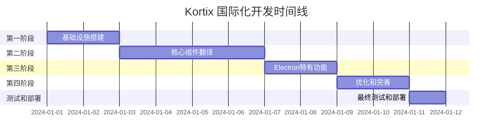

# Kortix 应用中文国际化开发任务列表

## 项目信息
- **项目名称**: Kortix (Suna) 国际化支持
- **目标语言**: 简体中文 (zh-CN)
- **技术栈**: Next.js 15.3.1 + React 18 + Electron + TypeScript
- **架构特点**: 双入口 (app/ Web端 + client/ Electron端) + 共享组件

## 总体计划
**预计总工期**: 11-16 个工作日
**项目里程碑**: 4个主要阶段
**团队配置**: 1-2名前端开发工程师

---

## 第一阶段：基础设施搭建 (2-3个工作日)

### 1.1 核心i18n系统开发
**负责人**: 前端开发工程师
**预计工期**: 1天
**优先级**: 🔴 高

#### 任务清单
- [ ] **创建i18n目录结构**
  - 创建 `src/i18n/` 目录
  - 创建 `messages/` 翻译资源目录
  - 设置基础文件结构

- [ ] **实现类型定义** (`src/i18n/types.ts`)
  - 定义 `Language` 类型
  - 定义 `TranslationKey` 和 `TranslationParams` 类型
  - 定义 `I18nContextType` 接口
  - 定义 `ElectronAPI` 接口

- [ ] **实现核心配置** (`src/i18n/index.ts`)
  - 实现语言检测逻辑 `detectLanguage()`
  - 实现翻译资源合并逻辑
  - 实现嵌套对象获取 `getNestedTranslation()`
  - 实现翻译格式化 `formatTranslation()`

- [ ] **实现React Context Provider** (`src/i18n/context.tsx`)
  - 创建 `I18nProvider` 组件
  - 实现 `useI18n` Hook
  - 实现语言状态管理
  - 实现Electron通信逻辑

- [ ] **创建便捷Hook** (`src/i18n/hook.ts`)
  - 导出主要i18n功能
  - 创建 `useTranslation` Hook
  - 提供命名空间支持

**验收标准**:
- [ ] 所有TypeScript类型定义正确
- [ ] Context Provider正常工作
- [ ] 语言检测逻辑在Web和Electron环境下都正常
- [ ] 翻译函数支持嵌套key和参数插值

---

### 1.2 翻译资源文件创建
**负责人**: 前端开发工程师
**预计工期**: 0.5天
**优先级**: 🔴 高

#### 任务清单
- [ ] **创建英文翻译文件** (`messages/en.json`)
  - 创建仪表板相关翻译
  - 创建通用UI组件翻译
  - 创建导航菜单翻译
  - 创建认证相关翻译
  - 创建表单验证翻译
  - 创建错误信息翻译

- [ ] **创建中文翻译文件** (`messages/zh-CN.json`)
  - 翻译所有英文内容
  - 确保翻译准确性和本地化适配
  - 检查文本长度和UI布局兼容性

- [ ] **创建Electron特有翻译** (`messages/electron.json`)
  - 翻译应用菜单项
  - 翻译系统对话框
  - 翻译通知消息

**验收标准**:
- [ ] 翻译文件格式正确
- [ ] 所有必要的翻译文本都已包含
- [ ] 中文翻译准确且符合中文表达习惯
- [ ] 支持参数插值的翻译正确配置

---

### 1.3 双入口Layout适配
**负责人**: 前端开发工程师
**预计工期**: 0.5天
**优先级**: 🔴 高

#### 任务清单
- [ ] **修改Web端Layout** (`src/app/layout.tsx`)
  - 导入 `I18nProvider`
  - 包装现有Providers
  - 实现服务端语言检测
  - 更新HTML lang属性

- [ ] **创建Electron端Layout** (`src/client/layout.tsx`)
  - 创建新的Layout文件
  - 集成 `I18nProvider`
  - 确保与Web端一致的Provider结构

- [ ] **测试双入口兼容性**
  - 验证Web端正常工作
  - 验证Electron端正常工作
  - 确保共享组件在两端都正常

**验收标准**:
- [ ] Web端应用正常启动和运行
- [ ] Electron端应用正常启动和运行
- [ ] i18n Provider在两端都正常工作
- [ ] 无控制台错误或警告

---

### 1.4 语言选择器组件开发
**负责人**: 前端开发工程师
**预计工期**: 0.5天
**优先级**: 🟡 中

#### 任务清单
- [ ] **创建语言选择器组件** (`src/components/language-selector.tsx`)
  - 实现下拉菜单式语言切换
  - 使用现有的UI组件库 (Radix UI)
  - 添加语言图标 (Globe)
  - 实现选中状态显示

- [ ] **集成到应用中**
  - 在导航栏中添加语言选择器
  - 确保在Web和Electron端都显示
  - 测试语言切换功能

**验收标准**:
- [ ] 语言选择器UI设计符合整体风格
- [ ] 语言切换功能正常工作
- [ ] 语言选择状态正确保存
- [ ] 组件在不同屏幕尺寸下正常显示

---

## 第二阶段：核心组件翻译 (4-5个工作日)

### 2.1 仪表板页面翻译
**负责人**: 前端开发工程师
**预计工期**: 1天
**优先级**: 🔴 高

#### 任务清单
- [ ] **翻译Dashboard主页面** (`src/components/dashboard/dashboard-content.tsx`)
  - 翻译主标题 "What would you like to do today?"
  - 翻译输入框占位符
  - 翻译示例文本
  - 翻译状态信息和错误消息

- [ ] **翻译Examples组件** (`src/components/dashboard/examples.tsx`)
  - 翻译所有示例卡片文本
  - 翻译分类标题
  - 确保文本长度适配UI

- [ ] **翻译Custom Agents Section** (`src/components/dashboard/custom-agents-section.tsx`)
  - 翻译标题和描述文本
  - 翻译代理卡片内容
  - 翻译操作按钮文本

**验收标准**:
- [ ] Dashboard页面所有可见文本都已翻译
- [ ] 翻译文本长度适中，不破坏UI布局
- [ ] 中文显示正常，无乱码或排版问题
- [ ] 交互功能正常，翻译不影响功能

---

### 2.2 共享UI组件翻译
**负责人**: 前端开发工程师
**预计工期**: 2天
**优先级**: 🔴 高

#### 任务清单
- [ ] **翻译基础UI组件** (`src/components/ui/`)
  - Button组件文本 (如果有硬编码)
  - Dialog和Alert组件文本
  - Form相关组件文本
  - Toast和Notification组件文本

- [ ] **翻译Navigation组件** (`src/components/sidebar/`)
  - 侧边栏菜单项
  - 导航图标提示文本
  - 用户菜单项

- [ ] **翻译Thread组件** (`src/components/thread/`)
  - 聊天输入框相关文本
  - 消息操作按钮
  - 文件上传相关文本
  - 语音输入相关文本

- [ ] **翻译Agent组件** (`src/components/agents/`)
  - 代理列表页面
  - 代理创建/编辑表单
  - 代理设置页面

**验收标准**:
- [ ] 所有共享组件的硬编码文本都已替换为翻译函数
- [ ] 组件在中文环境下显示正常
- [ ] 翻译不影响组件的原有功能
- [ ] 响应式布局在中文环境下正常工作

---

### 2.3 认证和用户管理翻译
**负责人**: 前端开发工程师
**预计工期**: 1天
**优先级**: 🟡 中

#### 任务清单
- [ ] **翻译认证页面**
  - 登录页面文本
  - 注册页面文本
  - 密码重置页面文本
  - 表单验证错误消息

- [ ] **翻译用户管理组件** (`src/components/basejump/`)
  - 用户账户选择器
  - 团队管理相关文本
  - 个人资料编辑页面

- [ ] **翻译设置页面**
  - 账户设置
  - 偏好设置
  - 通知设置

**验收标准**:
- [ ] 认证流程所有文本都已翻译
- [ ] 表单验证消息本地化
- [ ] 用户管理功能正常
- [ ] 设置页面所有选项都已翻译

---

### 2.4 错误处理和状态信息翻译
**负责人**: 前端开发工程师
**预计工期**: 0.5天
**优先级**: 🟡 中

#### 任务清单
- [ ] **翻译错误消息**
  - 网络错误消息
  - 服务器错误消息
  - 权限错误消息
  - 业务逻辑错误消息

- [ ] **翻译状态提示**
  - 加载状态文本
  - 成功提示文本
  - 警告提示文本
  - 信息提示文本

- [ ] **翻译Billing相关组件**
  - 订阅状态文本
  - 使用限制提示
  - 支付相关文本

**验收标准**:
- [ ] 所有错误消息都有对应的中文翻译
- [ ] 状态提示信息本地化
- [ ] 错误处理功能不受影响
- [ ] 用户体验流畅，无混合语言情况

---

## 第三阶段：Electron特有功能 (2-3个工作日)

### 3.1 Electron主进程国际化
**负责人**: 前端开发工程师 (Electron经验)
**预计工期**: 1天
**优先级**: 🔴 高

#### 任务清单
- [ ] **实现菜单国际化** (`electron/main.js`)
  - 创建菜单翻译资源
  - 实现动态菜单生成函数
  - 添加语言切换IPC通信
  - 处理macOS平台差异

- [ ] **实现系统对话框翻译**
  - 创建对话框翻译资源
  - 实现对话框翻译函数
  - 处理确认对话框
  - 处理文件选择对话框

- [ ] **实现通知翻译**
  - 翻译系统通知消息
  - 翻译更新通知
  - 翻译错误通知

**验收标准**:
- [ ] Electron应用菜单完全支持中文
- [ ] 系统对话框显示中文文本
- [ ] 语言切换时菜单实时更新
- [ ] 在不同操作系统下都正常工作

---

### 3.2 Electron渲染进程集成
**负责人**: 前端开发工程师
**预计工期**: 0.5天
**优先级**: 🔴 高

#### 任务清单
- [ ] **更新预加载脚本** (`electron/preload.js`)
  - 暴露语言相关API
  - 暴露翻译对话框API
  - 添加语言状态同步
  - 确保类型安全

- [ ] **实现Electron特有组件**
  - 创建系统对话框组件
  - 创建原生菜单调用组件
  - 实现语言状态同步

- [ ] **测试Electron集成**
  - 测试主进程和渲染进程通信
  - 测试语言切换同步
  - 测试原生功能翻译

**验收标准**:
- [ ] Electron主进程和渲染进程通信正常
- [ ] 语言状态在两端同步
- [ ] 原生功能完全支持中文
- [ ] 无Electron相关的控制台错误

---

### 3.3 平台特定适配
**负责人**: 前端开发工程师
**预计工期**: 0.5天
**优先级**: 🟡 中

#### 任务清单
- [ ] **适配不同操作系统**
  - Windows平台菜单适配
  - macOS平台菜单适配
  - Linux平台菜单适配
  - 处理平台特有的UI差异

- [ ] **处理字体和显示**
  - 确保中文字体在各平台正常显示
  - 调整字体大小和行高
  - 处理高DPI显示

- [ ] **优化Electron性能**
  - 优化翻译资源加载
  - 减少内存占用
  - 优化启动时间

**验收标准**:
- [ ] 在Windows、macOS、Linux上都正常显示中文
- [ ] 中文字体渲染清晰美观
- [ ] 应用启动和运行性能无明显下降
- [ ] 平台特定功能正常工作

---

### 3.4 Electron打包和测试
**负责人**: 前端开发工程师
**预计工期**: 1天
**优先级**: 🟡 中

#### 任务清单
- [ ] **配置打包脚本**
  - 更新Electron构建配置
  - 确保翻译文件包含在打包中
  - 配置不同平台的构建

- [ ] **测试打包后的应用**
  - 测试Windows安装包
  - 测试macOS应用包
  - 测试Linux应用包
  - 验证翻译功能在打包后正常

- [ ] **性能测试**
  - 测试应用启动时间
  - 测试内存使用情况
  - 测试语言切换性能

**验收标准**:
- [ ] 所有平台的打包版本都包含翻译功能
- [ ] 打包后的应用中文显示正常
- [ ] 应用性能满足要求
- [ ] 安装和卸载流程正常

---

## 第四阶段：优化和完善 (2-3个工作日)

### 4.1 性能优化
**负责人**: 前端开发工程师
**预计工期**: 1天
**优先级**: 🟡 中

#### 任务清单
- [ ] **优化翻译加载**
  - 实现按需加载翻译文件
  - 添加翻译内容缓存
  - 优化语言切换性能
  - 减少初始包大小

- [ ] **代码分割优化**
  - 分离翻译资源到独立chunk
  - 实现翻译懒加载
  - 优化Bundle大小
  - 配置适当的缓存策略

- [ ] **内存优化**
  - 优化翻译数据结构
  - 实现翻译结果缓存
  - 避免内存泄漏
  - 监控内存使用

**验收标准**:
- [ ] 应用启动时间无明显增加
- [ ] 语言切换响应迅速
- [ ] Bundle大小增长在合理范围内
- [ ] 内存使用稳定，无明显泄漏

---

### 4.2 错误处理和回退机制
**负责人**: 前端开发工程师
**预计工期**: 0.5天
**优先级**: 🟡 中

#### 任务清单
- [ ] **实现翻译缺失回退**
  - 添加翻译缺失检测
  - 实现优雅的回退机制
  - 添加开发环境警告
  - 确保用户体验不受影响

- [ ] **错误边界处理**
  - 添加i18n错误边界
  - 实现翻译加载失败处理
  - 添加用户友好的错误提示
  - 实现错误恢复机制

- [ ] **开发调试工具**
  - 添加翻译键检查工具
  - 实现缺失翻译报告
  - 添加翻译覆盖检测
  - 提供调试信息面板

**验收标准**:
- [ ] 翻译缺失时应用不会崩溃
- [ ] 有清晰的回退策略
- [ ] 开发时能及时发现翻译问题
- [ ] 错误处理不影响用户使用

---

### 4.3 测试和质量保证
**负责人**: 前端开发工程师
**预计工期**: 1天
**优先级**: 🟡 中

#### 任务清单
- [ ] **单元测试**
  - 为i18n核心功能编写测试
  - 测试翻译函数
  - 测试语言检测逻辑
  - 测试参数插值功能

- [ ] **集成测试**
  - 测试组件翻译集成
  - 测试语言切换流程
  - 测试Web和Electron集成
  - 测试错误处理机制

- [ ] **手动测试**
  - 全功能手动测试
  - 跨平台兼容性测试
  - 用户体验测试
  - 性能回归测试

- [ ] **代码质量检查**
  - TypeScript类型检查
  - ESLint代码规范检查
  - 翻译文件格式验证
  - 代码覆盖率检查

**验收标准**:
- [ ] 测试覆盖率达到80%以上
- [ ] 所有核心功能都有测试覆盖
- [ ] 代码质量符合项目标准
- [ ] 手动测试无重大问题

---

### 4.4 文档和部署准备
**负责人**: 前端开发工程师
**预计工期**: 0.5天
**优先级**: 🟢 低

#### 任务清单
- [ ] **编写开发文档**
  - i18n系统使用指南
  - 翻译文件维护规范
  - 新语言添加指南
  - 常见问题解答

- [ ] **更新项目文档**
  - 更新README.md
  - 更新部署文档
  - 更新开发环境设置文档
  - 添加国际化相关说明

- [ ] **准备部署**
  - 配置生产环境变量
  - 更新构建脚本
  - 准备部署检查清单
  - 配置监控和日志

**验收标准**:
- [ ] 文档完整且准确
- [ ] 新开发者能快速上手
- [ ] 部署流程顺畅
- [ ] 有完善的维护指南

---

## 风险评估和缓解策略

### 高风险项
1. **Electron兼容性问题**
   - **风险**: Electron渲染进程与Web环境的差异可能导致i18n系统异常
   - **缓解策略**: 早期进行Electron环境测试，准备备用方案

2. **性能影响**
   - **风险**: i18n系统可能影响应用性能，特别是启动时间
   - **缓解策略**: 实施代码分割和懒加载，设置性能预算

3. **翻译质量**
   - **风险**: 翻译不准确或不一致，影响用户体验
   - **缓解策略**: 多人审核翻译，建立翻译规范

### 中风险项
1. **第三方组件兼容性**
   - **风险**: 某些第三方组件可能不支持国际化
   - **缓解策略**: 评估关键组件的i18n支持，准备替代方案

2. **代码重构复杂度**
   - **风险**: 大量组件需要重构，可能引入新的bug
   - **缓解策略**: 分批重构，充分测试每个阶段

### 低风险项
1. **构建流程复杂化**
   - **风险**: 新的构建流程可能增加部署复杂度
   - **缓解策略**: 详细文档，自动化测试

## 质量标准

### 功能性标准
- [ ] 所有用户界面文本都支持中英文切换
- [ ] 语言切换功能在Web和Electron端都正常工作
- [ ] 翻译准确，符合中文表达习惯
- [ ] 原有功能不受影响，无功能回归

### 性能标准
- [ ] 应用启动时间增加不超过10%
- [ ] 语言切换响应时间不超过300ms
- [ ] Bundle大小增加不超过500KB
- [ ] 内存使用增加不超过10MB

### 兼容性标准
- [ ] 支持Chrome、Firefox、Safari、Edge最新版本
- [ ] 支持Windows 10+、macOS 10.14+、Linux (Ubuntu 18.04+)
- [ ] 支持移动端浏览器 (Safari iOS、Chrome Android)
- [ ] 支持不同屏幕尺寸和分辨率

### 代码质量标准
- [ ] TypeScript类型检查无错误
- [ ] ESLint检查无警告
- [ ] 测试覆盖率达到80%以上
- [ ] 代码审查通过率100%

## 交付物清单

### 代码交付物
- [ ] 完整的i18n系统源代码
- [ ] 中英文翻译资源文件
- [ ] 更新的组件代码 (移除硬编码文本)
- [ ] Electron主进程和渲染进程更新
- [ ] 构建和部署脚本更新

### 文档交付物
- [ ] 技术设计文档
- [ ] 开发任务列表
- [ ] i18n使用指南
- [ ] 翻译维护规范
- [ ] 部署和运维文档

### 测试交付物
- [ ] 单元测试代码
- [ ] 集成测试用例
- [ ] 手动测试报告
- [ ] 性能测试报告
- [ ] 兼容性测试报告

## 项目时间线

## 后续维护计划

### 短期维护 (1-3个月)
- 监控翻译使用情况
- 收集用户反馈
- 修复发现的翻译问题
- 优化性能问题

### 中期维护 (3-6个月)
- 添加新的翻译内容
- 支持更多语言 (如繁体中文)
- 完善翻译管理工具
- 优化用户体验

### 长期维护 (6个月以上)
- 支持RTL语言
- 实现翻译管理后台
- 支持协作翻译
- 建立翻译质量评估体系

---

**项目启动**: 按此任务列表执行开发工作
**最终目标**: 为Kortix应用提供完整的中英文双语支持，为未来多语言扩展奠定基础